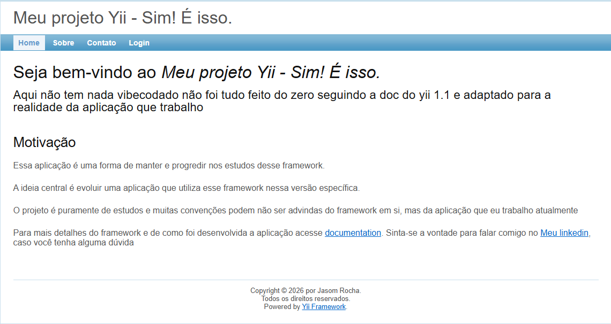

# Blog com Yii 1.1

Projeto de estudos desenvolvido com o framework **Yii 1.1**, com o objetivo de evoluir o conhecimento no framework utilizado no ambiente de trabalho. A aplicação consiste em um blog simples com autenticação de usuários.

> Muitas convenções adotadas aqui são inspiradas no projeto profissional onde o framework é utilizado em produção, e não necessariamente seguem o padrão padrão do tutorial oficial.

---

## Requisitos

- PHP >= 7.4
- Composer
- MySQL

---

## Instalação

Clone o repositório:

```bash
git clone git@github.com:JasomRocha/construindo-um-blog-usando-yii1.1.git
cd construindo-um-blog-usando-yii1.1
```

Instale as dependências:

```bash
composer install
```

---

## Configuração do Banco de Dados

Copie o arquivo de exemplo e preencha com suas credenciais:

```bash
cp app/config/database.example.php app/config/database.php
```

Edite o `app/config/database.php` com os dados do seu ambiente:

```php
'connectionString' => 'mysql:host=127.0.0.1;port=3306;dbname=yii_blog',
'username' => 'seu_usuario',
'password' => 'sua_senha',
```

---

## Rodando o Projeto

Suba o servidor embutido do PHP apontando para a pasta pública:

```bash
php -S localhost:8026 -t web/
```

Acesse no navegador: [http://localhost:8026](http://localhost:8026)

---

## Gii — Gerador de Código

O Gii é a ferramenta visual do Yii para geração de models e CRUDs. Para habilitá-lo, descomente o módulo no arquivo `app/config/main.php`:

```php
'gii' => array(
    'class'    => 'system.gii.GiiModule',
    'password' => 'sua_senha_aqui',
),
```

Acesse em: [http://localhost:8026/index.php?r=gii](http://localhost:8026/index.php?r=gii)

> **Atenção:** desabilite o Gii em produção.

---

## Estrutura do Projeto

```
├── app/        # Lógica da aplicação (privado)
│   ├── config/
│   ├── controllers/
│   ├── models/
│   └── views/
├── web/        # Arquivos públicos
│   ├── index.php
│   ├── assets/
│   └── css/
├── vendor/         # Dependências do Composer (não versionado)
├── composer.json
└── composer.lock
```